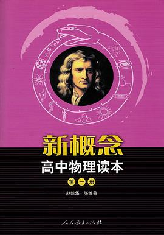

#### 物理

##### 教材

##### 《新概念高中物理读本》赵凯华著

说实话，人教版理科的教材编写质量一直让人不敢恭维，如果用来自学，薄薄一本，每个公式和定理的来龙去脉讲的相当跳跃，整个物理课本的主色调不是严谨的公式推理而是大量的留白和精美的插图，而且每个还把很多非常重要的知识隐藏在习题、课后阅读、注释框之类的边角料里，即便如此也是羞涩地不愿解释清楚。对于入门的学生来说，很难根据课本就梳理出核心的知识脉络，初读课本，可能会觉得高中知识不过如此，但等到真正做题时，却又会感到一筹莫展，只有囫囵吞枣地强行记住各种物理模型才能勉强跟上，于是只能收获一个支离破碎、模糊不清的知识体系。只有已经建立了完整知识体系的人，才能在回顾时对这些教材给出较高的评价。

但是市面上也不乏非常优秀的教材，如果有志于对物理的各个定理和现实应用有深刻理解的低年级同学，可以选择读一读赵凯华先生编著的《新概念高中物理读本》。这本书一方面对于通用课本中一笔带过的内容有完整的解释，对于弹性碰撞的速度变化公式，电流表的改造，避雷针的原理都很清楚的解释和完整的推导过程；同时，出于考试范围等原因，许多复杂内容需要引入大学物理中的概念才能解释清楚，然而十分可贵的是，作者从高中生角度用精确易懂的语言引入了必要的大学物理概念，例如惯性力（非惯性系下为什么牛顿第二定律不再适用，这个也是在2022年高三期末考到过），仅寥寥之笔，却让人有拨云见日之感。此书也对一些常考的应用和难点也有详尽的解释，例如加速器，感生电动势（虽然只有短短一页，但是写的相当精彩，甚至预料到读者的许多疑惑），霍尔效应，磁聚焦（甚至和部分选择压轴题有关）。

这本书，展示了教育应有的诚意，一种知识分享的诚意。

##### 补充视频

简介：李永乐老师早期在精华学校上课时录制的视频，讲课内容基本和高一高二校内上课内容一致，条理清晰，不时还有点小幽默。这个视频不论是用于自学、初学时没有学懂时的或是一轮复习的扫盲都十分合适。笔者曾跟着李永乐老师的视频在假期自学过部分章节。

链接:https://pan.baidu.com/s/1jzVyNKH6rD0g6WnG1oJNLA 提取码:j3tn

##### 工具书

市面上讲解各种解题方法的书很多了，这里仅介绍编者曾经使用过的《一本涂书》,个人比较欣赏相对简洁的排版风格，不那么容易分散注意力；内容上也比较全面，可以用于检索知识点和学习解题方法。

##### 练习册

在和老师答疑过程中了解到，练习册选择原则就是有答案和**清晰**的详解（请注意避开那种解析不过是把四个选项复述一遍的练习册），我深以为然。同样因为欣赏简洁的排版风格，个人认为《高中必刷题》和《高考必刷题》（以下简称《必刷题》）是不错的习题册，而五三在排版上个人认为要逊色很多，五三的题目分类方法比较让人摸不清头脑，而《必刷题》则写的很清楚简洁。**不过需要指出的是**，虽然《必刷题》收录的大多是外省题目，情景和计算偏复杂，但比起北京卷压轴题来说思维量并不大，很适合用于练习受力分析、各种守恒定理和计算基本功，做完之后相信你们都可以秒杀北京卷啦\doge