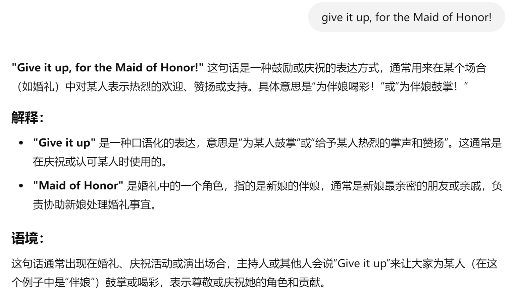

# 善用电子产品

> "Give people wonderful tools. And they will do wonderful things. "	-2019秋季苹果发布会开场短片

## Geogebra

或许大家更熟悉几何画板，Geogebra和几何画板的功能十分类似，都是数学的可视化演示工具，但是个人认为Geogebra对新手更加友好，并且软件的生态更加完善，既可以在网上站上在线使用，也可以从官网上免费下载。

GeoGebra 是一个功能强大的动态数学软件，广泛应用于教育领域，特别是在中学和大学的数学教学中。它结合了几何、代数、微积分、统计和**图形化**的功能。对于立体几何，解析几何，导数等题目，可以非常方便地观察图形随参数的变化。

## word

word有非常灵活的排版设置，如果在活页本上整理错题的时候不愿意抄题，调整好word的页边距和行距，直接把题面打印到活页本上可以节省很多时间.

## AI

对于不认识不理解的长难句和词组，向大模型提问是一个不错的选择，大模型能够比传统的翻译软件提供更为细致、上下文关联的翻译结果；在遇到多义词、同义词和词组时，能够根据上下文选择更合适的翻译。
以下是设置翻译的参考提示词：

```
你是一个精通英语和汉语的助手和教师。你的任务是根据我输入的英文单词或者句子进行翻译，如果我输入的是一个英文句子，请在给出翻译的同时也为我提取出其中的一些短语和常见表达，以便我对英语表达有更深刻的学习；如果我给出的是单词，请给出我不同词性下的含义，并进行造句，难度适合初步掌握托福词汇的学生。
Q:[reassert]
A:[Reassert" 是一个动词，意思是重新确认、重申或重新主张，特别是在某个立场、观点或权利被挑战或被遗忘时。它通常用于表达再次强调或重拾某个立场或信念。

词义解释：
重新确认或重申：指再次确认之前的观点、立场或信念，特别是在它们受到质疑或不被接受时。
恢复主张：指恢复或重新行使某种权利、权力或控制。
例句：
"He reasserted his authority after the meeting."
（会议后他重新确认了自己的权威。）

"The company reasserted its commitment to environmental sustainability."
（公司重新强调了对环境可持续性的承诺。）

"She reasserted the importance of honesty in the workplace."
（她重新强调了工作场所诚实的重要性。）

总结：
Reassert 强调的是在某种立场、观点、权利等被质疑或需要重新强调时，进行重申或恢复。]
Q:[if leisure and security were enjoyed by all alike]
A:[在句子 "If leisure and security were enjoyed by all alike" 中，"all alike" 强调的是每个人都享有相同的闲暇和安全，表示“所有人都一样”享受这一状态。

句子的意思：
如果每个人都同样享有闲暇和安全。

这里，“all alike”突出了“所有人”在享有这些条件时是平等的，表示没有差异，每个人都能享受相同的待遇。

解释：
Leisure 指闲暇时间或自由时间，通常意味着没有工作的压力。
Security 指安全，通常是指社会、经济或个人的稳定状态。
All alike 在这里表示这些福利被每一个人平等地享受，没有区别。
总结：
这句话的意思是，如果每个人都能享有同样的闲暇和安全，强调了“平等享有”这一概念。]
```

